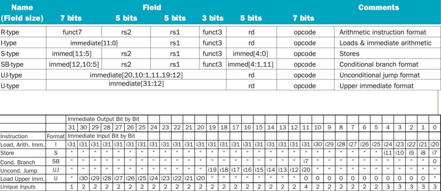
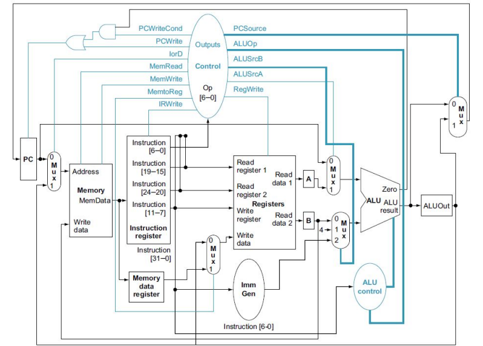
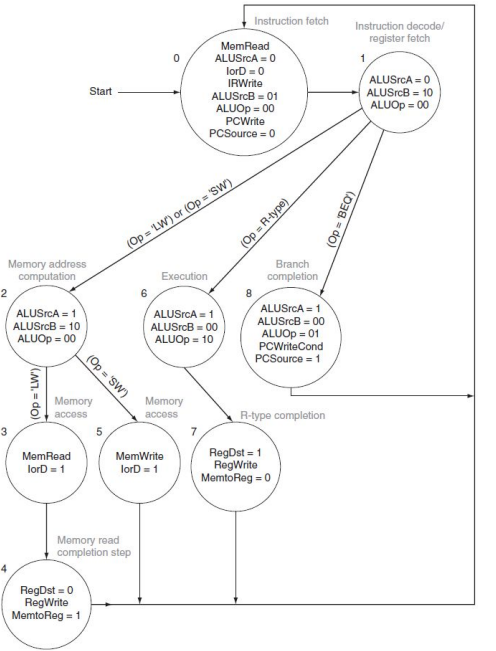
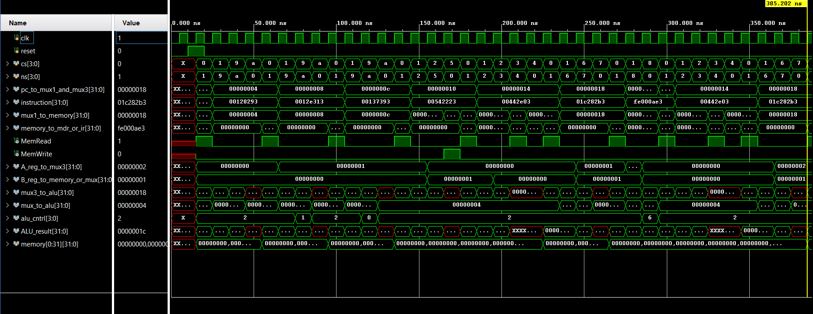

# RISC-V Multi-Cycle Microprocessor

A 32-bit multi-cycle RISC-V microprocessor designed and implemented from scratch using Verilog. This project demonstrates advanced computer architecture concepts, including finite state machine (FSM) control logic, datapath routing with intermediate registers, and resource sharing.
Unlike the single-cycle design, this microprocessor breaks down instruction execution into multiple distinct clock cycles (e.g., fetch, decode, execute, etc.), each instruction needing 3, 4 or 5 clock cycles to be executed. This approach allows the processor to reuse hardware components across different cycles, such as utilizing a single unified memory for both instructions and data, and a single ALU for all address and arithmetic computations.

### Instructions and instruction format
The current implementation supports the base integer instruction set (RV32I). Depending on the instruction, execution takes between 3 and 5 clock cycles:
* **R-Type (arithmetic/logic)**: `add`, `sub`, `and`, `or`, `xor` (4 cycles)
* **I-Type (immediate)**: `addi`, `andi`, `ori`, `xori` (4 cycles)
* **Load/Store**: `lw` (5 cycles), `sw` (4 cycles)
* **Branch**: `beq` (3 cycles)

RISC-V architecture relies on a fixed 32-bit instruction length. The table below illustrates how the bits are mapped and extracted for the instructions supported by this microprocessor:

### Components of the microprocessor
Because execution spans multiple clock cycles, new intermediate registers were introduced to hold data between steps.
* **Unified Memory**: a single, synchronous read/write memory module storing both the 32-bit machine code and program data (Von Neumann architecture).
* **Program Counter (PC)**: holds the address of the current instruction, updated via an enable signal (`PCWrite` or `PCWriteCond` and `Zero`).
* **Registers**: 32x32-bit registers with asynchronous read and synchronous write.
* **Intermediate Registers**: hold temporary values between clock cycles to prevent data loss. Includes the **Instruction Register (IR)**, **Memory Data Register (MDR)**, **A & B (ALU inputs)**, and **ALUOut (ALU output)**.
* **Immediate Generator**: performs sign-extension for I, S, and B type instructions.
* **ALU & ALU Control**: performs arithmetic and bitwise logic operations.
* **Control Unit (FSM)**: the brain of the multi-cycle microprocessor, implemented as an 11-state finite state machine.

### Control path (FSM)
In this architecture, the **Control Unit** is no longer simple combinational logic. It is implemented as a finite state machine (FSM).
Every instruction begins with the same two states: fetch (State 0) and decode (State 1). Afterward, the FSM branches into different paths depending on the 7-bit opcode. For example, a `lw` instruction, which takes 5 clock cycles to complete, will navigate through states 0 -> 1 -> 2 -> 3 -> 4, while a `beq` instruction, which only takes 3 clock cycles, will only 'visit' states 0 -> 1 -> 8.

### Simulation and tools
* **Hardware description language**: Verilog
* **Design/Simulation tools**: Xilinx Vivado
  
### How to run
1. Clone the repository
2. Import the `.v` source files into your preferred Verilog simulator. (or you can copy-paste the `multi-cycle-microprocessor.v`)
3. Write your machine code instructions and data (in hex) into the `memory.mem` file. (or you can use the one I have used)
4. Run the `tb_microprocessor.v` testbench to observe the instruction execution in the waveform viewer. (don't forget to add your desired signals to the waveform)

If everything was done right, the waveforms should look something like this, with the FSM states clearly visible if you added `cs` (current state) and `ns` (next state) to the waveforms:

